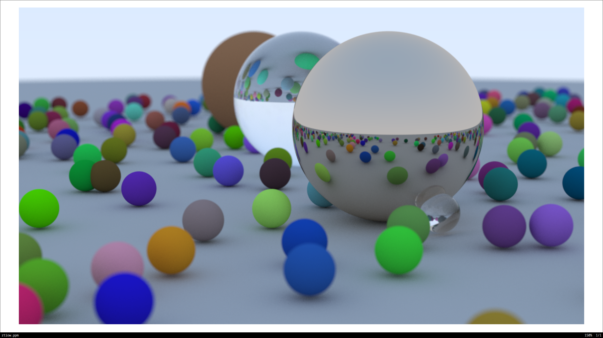

# Razz
Razz is a graphics and simulation playground exploring ray tracing, image transformation, and possibly physics

## Plan 
I'm currently following this book: [Ray Tracing: The Next Week](https://raytracing.github.io/books/RayTracingTheNextWeek.html) for this project. 
I finished the first book. I'm planning to finish all three series, then move on to frames by frames rendering. There is another thing I want to to do before I leave ray tracing, that is, render the image on Rust, then stream the data to the Arduino/RP2040 to render an image on 128x160 TFT screen. 

After that, I plan to learn physics, and make a physics simulation. To top everything off, I wanna write an interpreter so I can freely adjust the objects. Ambitious, I know. 

## Challenges 
### Ray Tracing In One Weekend
I understand most of the part in Ray Tracing In One Weekend. Three quarter of the book does required me to do write out the math, or just understanding them in general. However, the latter quarter...is something else. The math gets more abstract, less explanation of why this is the case, and leave more of the math to the mathematicians. It is a valid approach to not fully understand the math from a CS perspective, however, I feel like I've been left too much in the dark. I'll try to brush up my math still for the next chapter. 

### Arduino 
Arduino poses challenging problems like hardware constraints, embedded system protocol, hardware, and timing issue. Here are a list of things that I had trouble with: 
* Hardware Constraints: Arduino Uno only have 2KB of RAM, but the TFT render have 128x160 (Yes, this is another issue-ish where the dimension is a bit weird how width is 128 and height is 160). This means that I can't store all image in a buffer of 128 * 160 * 3 (RGB Value). The solution I used for this was converting RGB888 to BGR565, which means converting 3 bytes RGB down to 2 bytes. Still doesn't resolve the limited RAM though. I decided to use a temporary smaller buffer of size 512, flush it when the buffer is full, or when image received. Worked pretty well. 
* Embedded System Protocol: I learned how to send Magic Bytes to verify and to have a fall back state. Setup header struct with image dimension, sending byte by byte to the serial. Also learned what checksum is, and how can I use that to verify my data. Another problem that took hours to debug was I open a connection with Arduino and send data to early, the image was noisy and the color was wrong. I had to enforce a longer timeout for the port to be ready. Moreover, I had a state machine on Arduino to verify the work, with bit manipulation and fall back state in case someting is corrupted. 
* Hardware Issue: For some reason, my TFT screen uses BGR instead of RGB. That wasn't big of an issue. The timing issue with port openning delay is worse, with noisy color etc. I thought it was hardware issue since the picture rendered ONCE, and never again. I tried to use initR() but then it started to draw from a quarter of the screen to the right instead from regular left to right, hence the 128x160 issue. I went back to begin() and it worked better. Also, I use setAddrWindow to keep the hardware connection "hot". Luckily, with the API, the pushColor() accept a 565 color value, so I just need to pass from my protocol.


## Image 
### Ray Tracing In One Weekend


## Video 
### Arduino 
https://github.com/user-attachments/assets/beb13901-d2f5-4c20-9113-03e83370cab0

## Run 
To run, do 
```bash
cargo run --release -- --output test.ppm --width 1000 --height 1000
```

