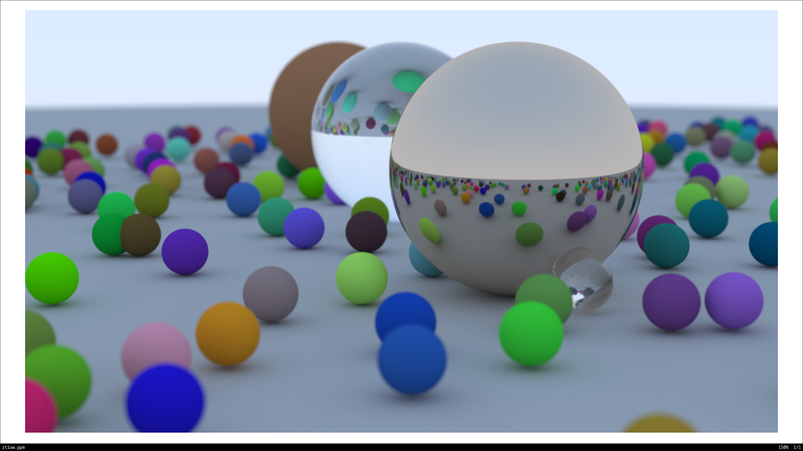

# Razz
Razz is a graphics and simulation playground exploring ray tracing, compilers, image transformation, and possibly physics

## Plan 
I'm currently following this book: [Ray Tracing: The Next Week](https://raytracing.github.io/books/RayTracingTheNextWeek.html) for this project. 
I finished the first book. I'm planning to finish all three series, then move on to frames by frames rendering. There is another thing I want to to do before I leave ray tracing, that is, render the image on Rust, then stream the data to the Arduino/RP2040 to render an image on 128x160 TFT screen. 

After that, I plan to learn physics, and make a physics simulation. To top everything off, I wanna write an interpreter so I can freely adjust the objects. Ambitious, I know. 

## Challenges 
### Ray Tracing In One Weekend
I understand most of the part in Ray Tracing In One Weekend. Three quarter of the book does required me to do write out the math, or just understanding them in general. However, the latter quarter...is something else. The math gets more abstract, less explanation of why this is the case, and leave more of the math to the mathematicians. It is a valid approach to not fully understand the math from a CS perspective, however, I feel like I've been left too much in the dark. I'll try to brush up my math still for the next chapter. 


## Image 
### Ray Tracing In One Weekend


## Video 
### Arduino 
(ignore my dusty laptop)
https://github.com/user-attachments/assets/beb13901-d2f5-4c20-9113-03e83370cab0

## Run 
To run, do 
```bash
cargo run -p razz-renderer --release -- --output test.ppm --width 1000 --height 1000
```

